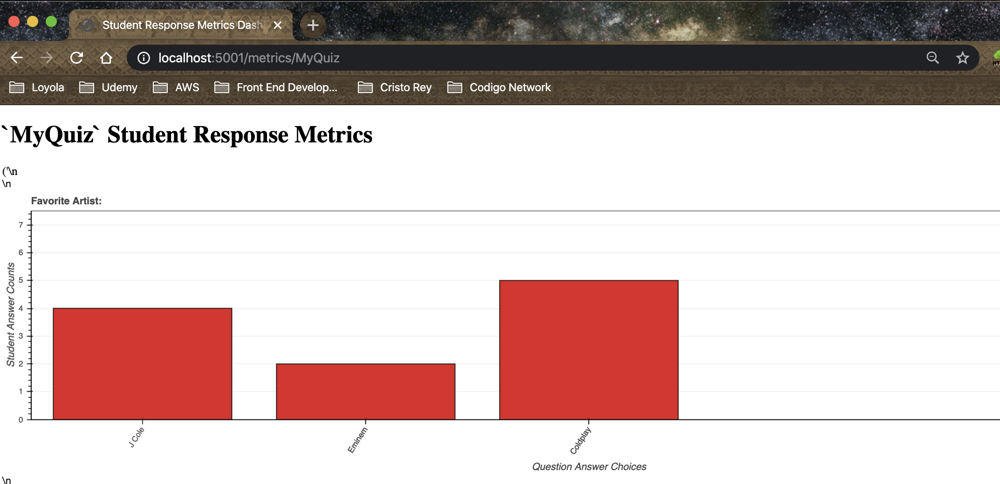

# Distributed-Systems
[](https://travis-ci.com/alake16/Distributed-Systems)
Creating a standalone program to model the creation of quiz questions and the tracking of answers from multiple users. Questions are modeled in JSON format for persistent storage. The Flask framework is used to manage communications between the front and back ends of our project.

# Development API Server Operation
To deploy the quiz responses API server, run the following command from the project's root directory:
```bash
env FLASK_APP=server.py flask run --port 5000
```

# Development API Server Operation
To deploy the application's web server, run the following command from the `app` directory:
```bash
env FLASK_APP=routes.py flask run --port 5001
```

# Unit tests
To run the unit tests you can use the Makefile
```bash
make test
```

# Sphinx Documentation
To generate the sphinx documentation
```bash
cd docs
make html
sphinx-serve -h 127.0.0.1
```
Go to 127.0.0.1:8001 in a web browser.

# Validating Phase 1 Step-by-Step

1. Clone the repository to your local environment:
```bash
git clone https://github.com/ddpalacios/Distributed-Systems.git
```

2. Once cloned, cd into the project and run the command `env FLASK_APP=server.py flask run`

```bash
> cd Distributed-Systems
> make init
> env FLASK_APP=server.py flask run
```

Running the `env FLASK_APP=server.py flask run` command will start the project's server on localhost port 5000.  If executed successfully, console output should look as follows:

```bash
> env FLASK_APP=server.py flask run
 * Serving Flask app "server.py"
 * Environment: production
   WARNING: This is a development server. Do not use it in a production deployment.
   Use a production WSGI server instead.
 * Debug mode: off
 * Running on http://127.0.0.1:5000/ (Press CTRL+C to quit)
```

You may also run the project's UI by running the following command within the project's root directory:

```bash
env FLASK_APP=app/routes.py flask run --port 5001
 * Serving Flask app "app.routes"
 * Running on http://127.0.0.1:5001/ (Press CTRL+C to quit)
```

3. The user can now create a new quiz question by making a POST request to the following endpoint: `localhost:5000/activateQuestion` with a JSON payload that conforms to the following JSON structure:

```json
{
    "type": "multiple_choice",
    "prompt": "Worst topping on pizza:",
    "choices": ["Sausage", "Pineapple", "Anchovies"],
    "answer": "Anchovies"
}
```

Below is an example cURL POST call that will successfully POST a new question.  This mimics an instructor providing a questions for his/her students to answer (This is an example of a `multiple_choice` question. The `prompt` attribute is the question, and the `choices` attribute lists the answer choices).


```bash
> curl -i \                                                                                                             
> -H "Content-Type:application/json" \                                                                                  
> -X POST \                                                                                                             
> -d '{"type": "multiple_choice", "prompt": "Worst topping on pizza:", "choices": ["Sausage", "Pineapple", "Anchovies"],
"answer": "Anchovies"}' \                                                                                               
> http://localhost:5000/activateQuestion

```

Which yields the following response:

```bash
  % Total    % Received % Xferd  Average Speed   Time    Time     Time  Current                                         
                                 Dload  Upload   Total   Spent    Left  Speed                                           
100   363  100   227  100   136   1075    644 --:--:-- --:--:-- --:--:--  1720HTTP/1.0 200 OK                           
Content-Type: application/json                                                                                          
Content-Length: 227                                                                                                     
Server: Werkzeug/0.16.1 Python/3.8.1                                                                                    
Date: Sun, 09 Feb 2020 05:46:29 GMT                                                                                     

{"kind": "question", "object_id": "a900e6f0-39f6-46a5-a495-7a83a8aec266", "type": "multiple_choice", "prompt": "Worst to
pping on pizza:", "choices": ["Sausage", "Pineapple", "Anchovies"], "answer": "Anchovies", "responses": []}             
```


4. Step 3 mimics the instructor providing a question to his/her students.  Now, the student can submit an answer by submitting a POST request to the `/recordResponse` endpoint with a JSON body that conforms to the following structure:

```json
{
	"user_id": "ry539h-75fi-je84o-urijf",
	"nickname": "some-COMP439-student",
	"choice": "Anchovies"
}
```

The following cURL call submits a response for a student nicknamed `some-COMP439-student`, with an answer of `Anchovies`:

```bash
$ curl -i \
> -H "Content-Type:application/json" \
> -X POST \
> -d '{ "user_id": "ry539h-75fi-je84o-urijf", "nickname": "Still-Another-COMP439-Student", "choice": "Anchovies" }' \
> http://localhost:5000/recordResponse

```
Which yields the following response from the server:

```bash
  % Total    % Received % Xferd  Average Speed   Time    Time     Time  Current
                                 Dload  Upload   Total   Spent    Left  Speed
  0     0    0     0    0     0      0      0 --:--:-- --:--:-- -100   210  100   102  100   108    488    516 --:--:-- --:--:-- --:--:--  1004HTTP/1.0 200 OK
Content-Type: application/json
Content-Length: 102
Server: Werkzeug/0.16.1 Python/3.8.1
Date: Sun, 09 Feb 2020 05:56:27 GMT

{"choice":"Anchovies","nickname":"Still-Another-COMP439-Student","user_id":"ry539h-75fi-je84o-urijf"}
```

To mimic additional students answering this question, the same POST request can be made to the endpoint so long as the JSON payload contains a unique `user_id` and `nickname` for each response (this simulates a different student providing each answer). This is demonstrated below:

```bash
$ curl -i \
> -H "Content-Type:application/json" \
> -X POST \
> -d '{ "user_id": "3ed4-4tww-32tedd-ur42f", "nickname": "another-COMP439-Student", "choice": "Sausage" }' \
> http://localhost:5000/recordResponse
```

5. Finally, an instructor can submit a GET request to the `/fetchResponses` endpoint to view all of the student responses (this is currently being outputted to console).  This can be achieved as follows:

```bash
curl -i -H "Content-Type:application/json" -X GET localhost:5000/fetchResponses
```

Which will yield a list of all of the students and their answers:

```bash
[
    {
        "kind": "response",
        "type": "multiple_choice",
        "choice": "Anchovies",
        "user_id": "ry539h-75fi-je84o-urijf",
        "nickname": "some-COMP439-Student"
    },
    {
        "kind": "response",
        "type": "multiple_choice",
        "choice": "Sausage",
        "user_id": "3ed4-4tww-32tedd-ur42f",
        "nickname": "another-COMP439-Student"
    }
]
```

<hr/>

# Visualizing Student Metrics

The Instructor UI allows the instructor to visualize student responses via bar charts. For each quiz, the instructor may produce a series of questions.  Once the question has been deactivated by the instructor, the instructor can then access `/metrics/{quiz_name}` to view the response counts for each answer in the specified `{quiz_name}`.  A step-by-step walkthrough for creating a quiz, submitting answers and visualizing them is described below:

1. First, run the `server.py` and `routes.py` files as follows:

```bash
> env FLASK_APP=server.py flask run
 * Serving Flask app "server.py"
 * Environment: production
   WARNING: This is a development server. Do not use it in a production deployment.
   Use a production WSGI server instead.
 * Debug mode: off
 * Running on http://127.0.0.1:5000/ (Press CTRL+C to quit)
```


```bash
env FLASK_APP=app/routes.py flask run --port 5001
 * Serving Flask app "app.routes"
 * Running on http://127.0.0.1:5001/ (Press CTRL+C to quit)
```

2. You are now ready to create a new quiz.  To do this, simply send a `POST` request to the
`/activateQuestion` endpoint, along with one query parameter `questionName` with which you will specify the name for your new quiz. Below is an example of the creation of a new multiple_choice question. The new quiz's name is `MyQuiz`, along with a `POST` body containing the quiz question, and an answer key:

```bash
localhost:5000/activateQuestion?quizName=MyQuiz
```

POST Body example Payload:
```bash
{
    "type": "multiple_choice",
    "prompt": "Favorite Artist:",
    "choices": ["J Cole", "Eminem", "Coldplay"],
    "answer": "Coldplay"
}
```

3. After executing step 2, a new quiz titled `MyQuiz` will have been created and will contain the question detailed in the `POST` body.  It will also be made active, meaning a student can now answer it.  In order for a student to answer the question, he/she can submit a `POST` request to the following endpoint:

```bash
localhost:5000/recordResponse
```

Below is an example request:

URL: `localhost:5000/recordResponse`

POST Body Example Payload:
```bash
{
	"type":"multiple_choice",
	"user_id": "ry539h-75fi-je84o-urijf",
	"nickname": "Matt",
	"answer": "Eminem"
}
```

You can submit as many responses as you'd like.  If a response that is not in the list of question `choices` (in this case {"J Cole", "Eminem", Coldplay}), and error will be returned from the API.

You can view a list of all recorded responses via submitting a GET request to the following endpoint:
```bash
localhost:5000/fetchResponses
```

In this example, this will yield the following response:

```bash
[
    {
        "question_id": "be1d8dad-8cb2-4da1-aa91-ccd368c14e30",
        "kind": "response",
        "type": "multiple_choice",
        "answer": "Eminem",
        "user_id": "ry539h-75fi-je84o-urijf",
        "nickname": "Matt"
    }
]
```

If additional responses were submitted, the list will contain additional entries.


4. In order for the counts to be recorded, the activeQuestion needs to be deactivated. In order to trigger this, submit an empty `POST` request (a `POST` request with no body) to the following endpoint:  `localhost:5000/deactivateQuestion`.  This will return a list of all responses recorded for the now-deactivated question (The response will be the same as the response received from `localhost:5000/fetchResponses`).

5. Once the question has been deactivated, you may view a list of all questions registered to a specific quiz name by submitting a `GET` request to the following endpoint:

```bash
localhost:5000/allQuestionsByQuizName?quizName=MyQuiz
```

This will return:

```bash
{
    "questions": [
        {
            "kind": "question",
            "object_id": "be1d8dad-8cb2-4da1-aa91-ccd368c14e30",
            "type": "multiple_choice",
            "prompt": "Favorite Artist:",
            "choices": [
                "J Cole",
                "Eminem",
                "Coldplay"
            ],
            "answer": "Coldplay",
            "responses": [
                {
                    "question_id": "be1d8dad-8cb2-4da1-aa91-ccd368c14e30",
                    "kind": "response",
                    "type": "multiple_choice",
                    "answer": "Eminem",
                    "user_id": "ry539h-75fi-je84o-urijf",
                    "nickname": "Matt"
                }
            ]
        }
    ]
}
```

If you'd like to add additional questions, repeat step 1 with a different question prompt in the JSON `POST` body, but with the same quiz name in the query parameter.


6. To view the `MyQuiz` response metrics, access the following URL:

```bash
http://localhost:5001/metrics/{quiz_name}
```
replace {{quiz_name}} with the name of the quiz you created (`MyQuiz`)


You should see a histogram for each question registered under your quiz name.  Since this example's `MyQuiz` quiz only had one question, only one histogram showing the questions responses will appear. You will see one histogram per question.  Below is the figure generated after following these steps. The histogram represents the same question where `J Cole`, `Eminem` and `Coldplay` were answered 4, 2 and 5 times, respectively:



<hr/>


# Contributors
Vismark Juarez (https://github.com/VismarkJuarez)
Brian Dehlinger (https://github.com/BrianDehlinger)
Daniel Palacios (https://github.com/ddpalacios)
Andrew Lake (https://github.com/alake16)

Mobile-side Android Application Repository: https://github.com/VismarkJuarez/Distributed-Systems-Mobile
